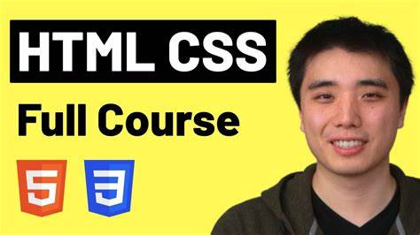

# webDev
This is a web development repository made for students of AEC to practice and learn to build websites and web development.

# Format recomendation
> Create folders for each language like `Html`, `css`, `javascript` and create a `pure` folder containing the code written in it's pure language.

> Create `Framework` folders in the main language folder and put folders in the name of the frameworks in that main language folder.

>create `media` folders in the your front branch directory.

# Recomended Tutorials
some recomended tutorials are given bellow

## HTML and CSS

